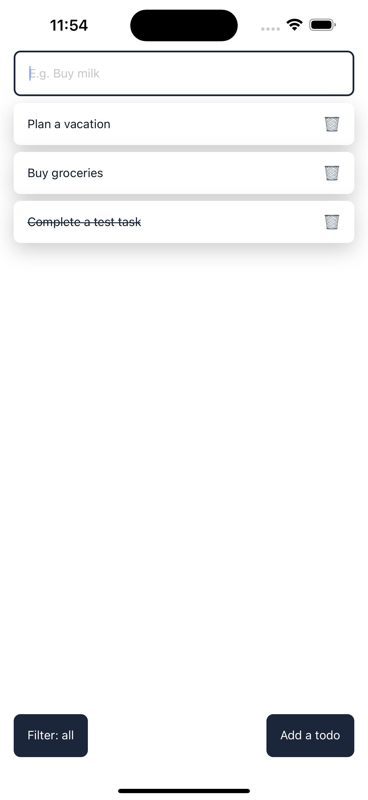

# Yet another todo app

A simple todo app built on React Native. It uses device storage as a fake API and does some data caching.

- Press on a todo to mark it as completed
- Press on 🗑 to delete a todo
- Press and hold on a todo to edit

<p align="center">
  
  
</p>

## Running the app

```
npm install

expo run ios
<!-- OR -->
expo run android
```
